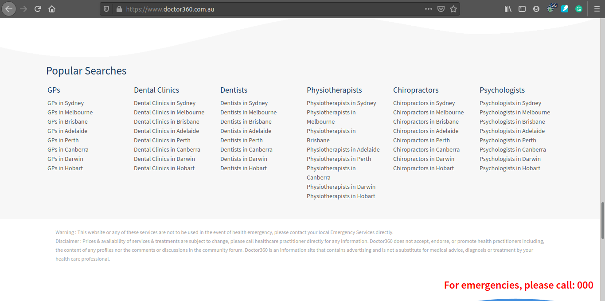
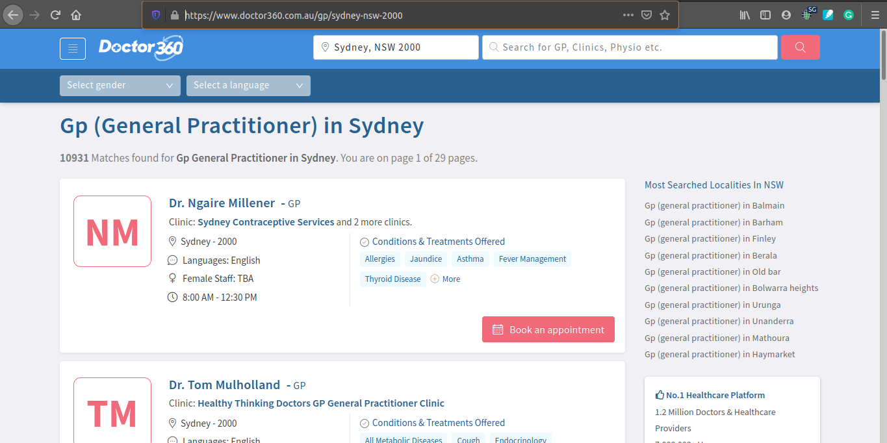
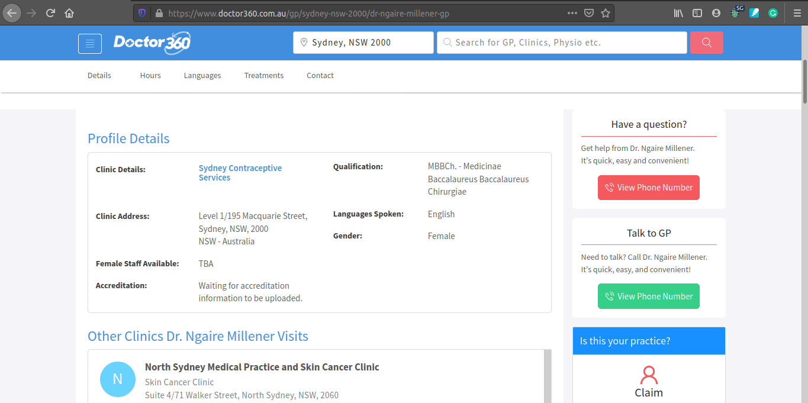
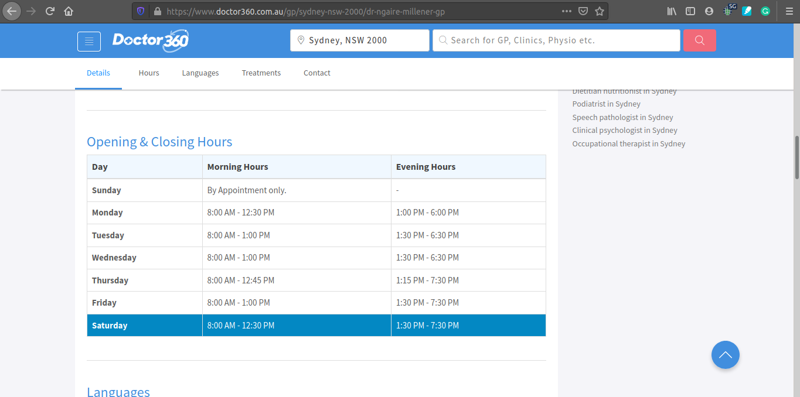

Scrape doctor profile and schedule from https://www.doctor360.com.au using following library

    request
    json
    BeautifulSoup
    Selenium

Flow of scraper are following

    1. Extract doctor name and their specialty from every city in Australia from following URL, https://www.doctor360.com.au/
    2. For each doctor specialty and their city, extract their name while at the same time extract clinic they've already registered also the schedule
    3. Import the result into JSON
    
Front page contain list of doctor category for each city

Second page, contains list of doctor member for each city and specialty

Third page, contains doctor profile detail

Third page, also contains doctor schedule

